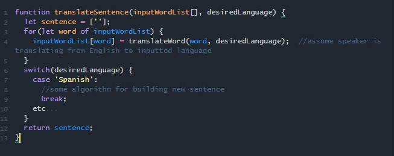

I never had a passion for anything more specific than the plain action of thinking. Seriously, I don't even enjoy asking questions or being asked about my thoughts, this passion is completely self-centered and self-directed. It can be exhilarating to finally learn something new; the realization that looking into outer space with a telescope is a look into the past, practicing the latest viral dance move, the thrills of a new language are a few of the things that spontaneously combust my mind. 

As a young adult, I became obssessed with becoming multilingual. The patterns and similarities I noticed within the Italian, Spanish, and French languages stimulated a drive in me to do more drills and speak in longer sentences. However, my practice felt more purposeful than reading and writing. There was a formula, a certain algorithm for each sentence of variables. Each word in English maps to a translation in another language. Given an input array of strings (the sentence), acquire translations for each object and rearrange into a sentence according to the desired language:

It probably seems weird to you and that's understandable; it's also weird to me. Weird, challenging, intimidating, but worth it. Could you imagine being an American tourist in a country where nobody speaks English? I don't have to imagine that, I feel it whenever I try to code, and you may feel the same sometimes. Regardless of prior experience, I always feel the same degree of stress, but each subsequent lesson drives me to think more. The most important part is that I go to sleep knowing more than I did when I woke up. The incrementing demand and effort keep me satisfied and coming back for more, and I intend to maintain that drive beyond the classroom.
