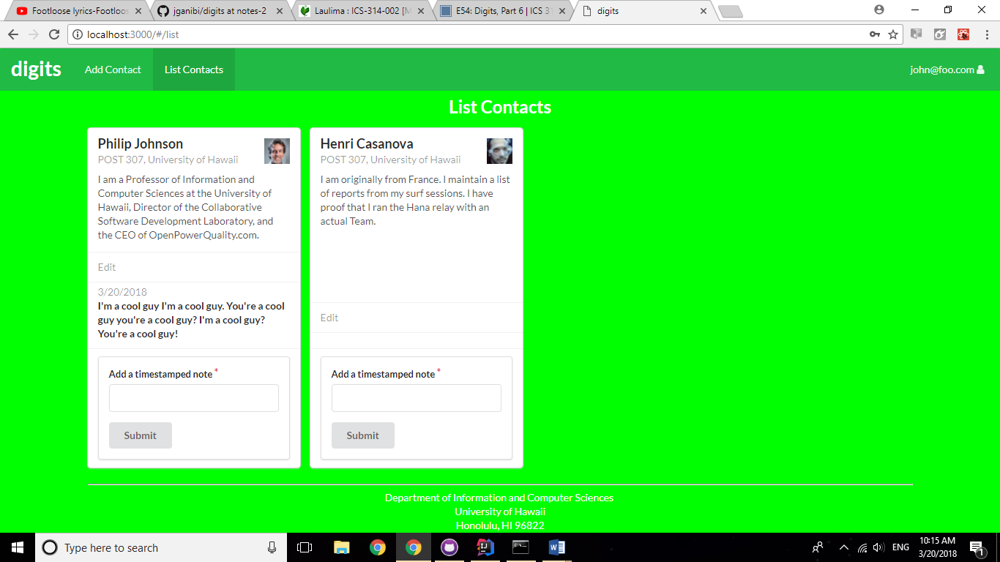

Coding has never been sunshine or rainbows for me, but it has slowly become easier for me to convince myself that the workload and late nights would be worth it. Web Development is an especially promising tool for a Software Engineer's resume, and its applications are becoming more and more in demand. I've been learning Web Development for only four months, and there's been twists and turns with each lesson. Despite the nauseating experience, there are open-source methods that provide a mental shortcut through the most commonly occurring problems in software design. Design Patterns can provide repeatable and reusable solutions for these problems, and though they can't help me through the ride, they can help me get ready for it.

In one of my first programming classes, Object-Oriented Programming had us learn classes, inheritance and constructors. By constructing classes of datatypes and functions in our own libraries, we could derive other classes and build new functions by inheriting from these libraries. Creational Design Patterns apply those concepts in developing web-based applications. My Meteor apps used a design pattern that created several different classes and derived instances of these classes in other modules. This Abstract Factory and Factory Method structure saved time on rewriting functions and classes, giving me more time to make more robust and unique instantiations across several different functioning modules.

Web-based applications have a wide range of uses and appearances, but there are generally recurring patterns in their structures. Structural Design Patterns guide creators on composing interfaces for their users. The Meteor app Digits, for instance, has an administrator instance that shows all existing accounts, as opposed to just the contacts created by the registered user. Design Patterns have drawn some criticism in response to their ambiguity and informality, which could lead to inefficient solutions. Although accidents can happen, and web applications may crash, Design Patterns can still help me feel safer on the road and more eager to drive through the bumps on the road.

