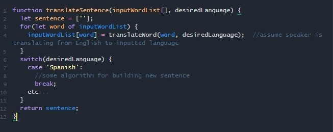

I never had a passion for anything more specific than the plain action of thinking. It can be exhilarating to learn about something I've never considered before; the realization that looking into outer space with a telescope is a look into the past, practicing the latest viral dance move, the thrills of a new language are a few of the things that spontaneously blow my mind. 

Though I have no prior experience with the software or engineering involved, I tend to just try thinking about topics such as missile defense and cybersecurity in terms of code. Since I am working on Computer Vision, I'm hoping to experience software involving heat detection, an important utility in missile defense. For now, I am eager to learn problem-solving methods that can be applied to software development. This should help me in learning software that is more relevant to the topics I'm most interested in. 

As a young adult, I became obssessed with becoming multilingual. The patterns and similarities I noticed within the Italian, Spanish, and French languages stimulated a drive in me to do more drills and speak in longer sentences. However, my practice felt more purposeful than reading and writing. There was a formula, a certain algorithm for each sentence of variables. Each word in English maps to a translation in another language. Given an input array of strings (the sentence), acquire translations for each object and rearrange into a sentence according to the desired language:

It probably seems weird to you and that's understandable; it's also weird to me. This is just my way of coping with my lack of experience in my strongest interests. I'm hoping to eventually be able to think about more interesting topics such as missile defense and cybersecurity in terms of code like this, not necessarily in javascript. If I don't develop the skills necessary to work in national defense in school, I will do everything I can to figure them out at home.
