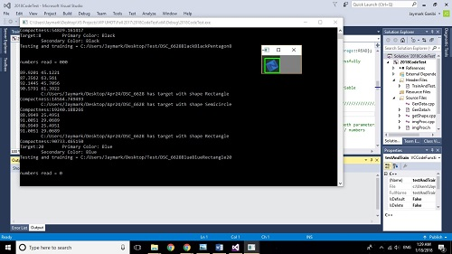

VIP UHDT is a vertically integrated project which is open to all undergraduate classes at the University. The team of UHDT is split into four subsystems that collaborate on the team's Unmanned Aerial System, from the structure of the Aircraft to the programs that make up its autonomous Image Processing. Our team's main event this year is a national competition which tasks each team with an autonomous simulation of a search-and-rescue mission. This mission is executed by the UAS surveying an open grass field with randomly placed targets, which our Image Processing will distinguish by applying object detection methods to the images taken by the UAS's camera. Our UAS will then autonomously plot a flight path towards each target such that it can drop and disperse water onto each target to simulate a rescue from a fire. Teams will be ranked based on many factors such as the accuracy of detected targets, proximity of water delivery, and the run-time of their missions.

This year, I am a programmer under the project's Image Processing subsystem. I started on this project by completing tutorials on OpenCV-based C++ basics, such as declaring dependencies, grayscaling images and alphanumeric detection and recognition. After familiarizing myself with these concepts, I built on last year's image processing program by implement alphanumeric detection along with its pre-existing shape and color recognition. I still need to utilize alphanumeric recognition to determine the exact characters that are being detected in each image. This will help reduce the false positives generated by the image processing program, enhancing our target accuracy and helping to reduce the mission run-time.

