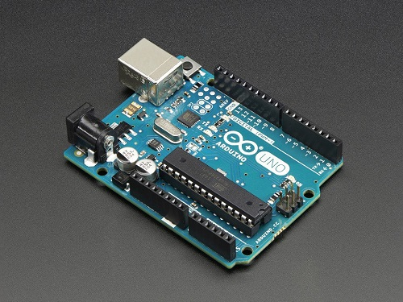

The objective of this two-person project was to develop a mobile app and real-life application for an Arduino microcontroller. Within the 2016 Fall semester, my partner, Brandon Wong, and I created a prototype of a fingerprint-based solenoid lock for an instrument case, and a MI2 Inventor based mobile app that displays the GPS coordinates of the case's location, this display updates every three seconds. As the primary programmer of the group, I was able to gain experience with building code for fingerprint sensors and GPS trackers, while MI2 App Inventor gave me a simple introduction to Android app development. 
 
This [YouTube Video](https://www.youtube.com/watch?v=izAxeNXCFF8) documents our project and demonstrates the bluetooth-based GPS and fingerprint lock in action.
