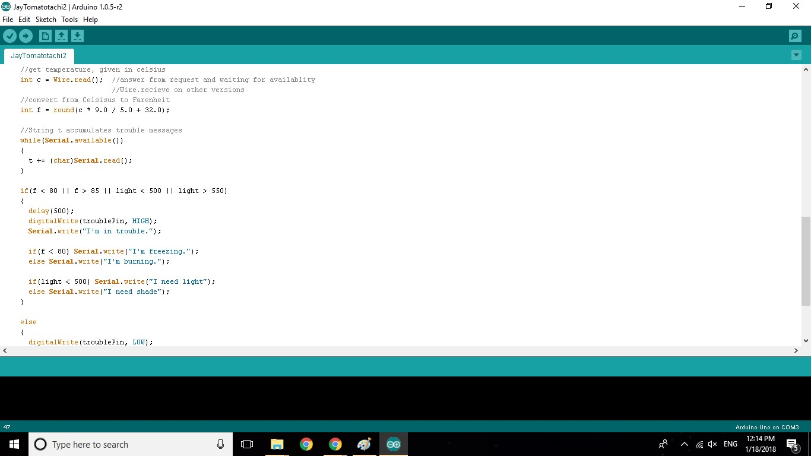

Using MI2 App Inventor, I designed a mobile app to simulate a tomato plant. As shown below, the user must connect to the app and Arduino board through Bluetooth. Based on inputs read from the board, the mobile app will sound alerts on the user's phone when the plant is too hot or cold, or needs shade or more light. These warnings occur every 3 seconds, but the plant will be silent while there are no problems.

Along with the block code on MI2 App Inventor, I also had to program the signals that the board would send to the app, an example of that code is shown below:

The microcontroller reads temperature and lighting from two seperate input wires, then writes trouble messages onto the Bluetooth module based on these inputs and lights up an LED on the board indicating that there is a problem. The app then reads these inputs from the Bluetooth module and notifies the user accordingly through his/her device. If there is no trouble, the trouble LED remains off, and the app remains silent.
