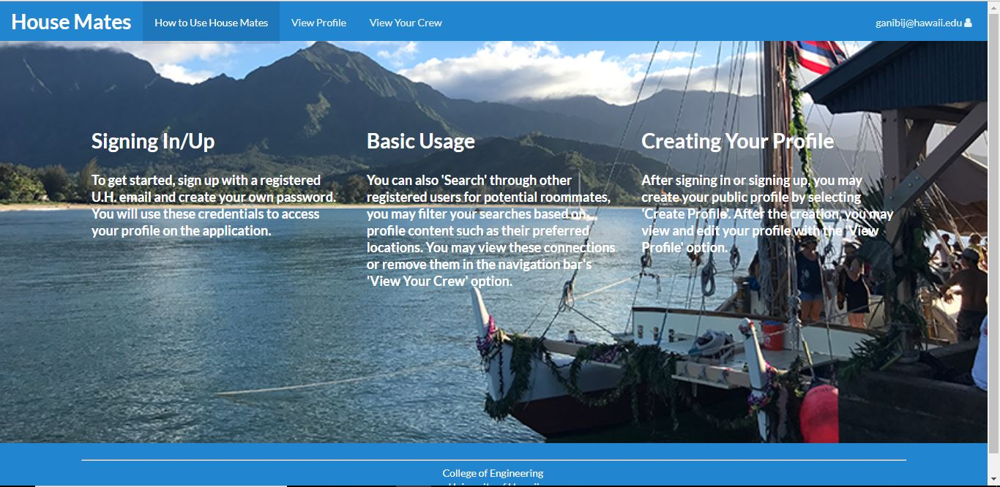
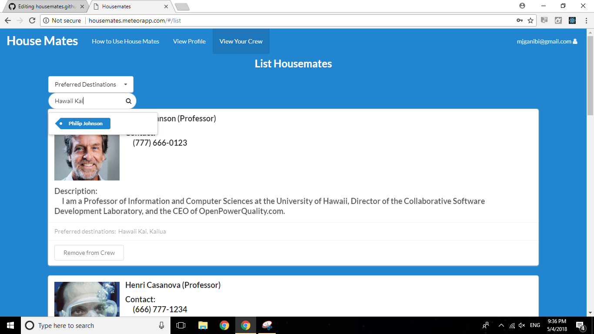

College students have more time to study and enjoy extracuricular activities when they live closer to campus. However, on-campus housing gets crowded fast, and housing units close to a college campus can be too expensive for young locals that haven't had a job before. Despite these setbacks, many locals would like the chance to start living outside of their parents' houses. I was one of a three-member team that designed a web-based application to give users in the U.H. community an opportunity to find off-campus housing and roommates to mitigate the costs. 

This web app was deployed using Meteor Galaxy, and the public repository is located [here](https://github.com/housemates/housemates). When a user enters the app, the Landing Page gives a basic overview of the application and its features. Users may also read the Tutorial Page which elaborates on these features as shown below:

Users can view this user guide without being signed in or registered on the site. However, they will need to sign in and create their profile to start using the features, such as searching for other registered users that could be potential roommates. Our application provides a view of all registered profiles, with information such as contact information, class standing (first year, seniors, professors, etc.), and the areas they prefer to live in.

As shown above, if users no longer wish to view another user, they may also Remove a profile from their view. Overall, this app is meant to allow U.H. users to find potential roommates and collaborate to find off-campus housing.
